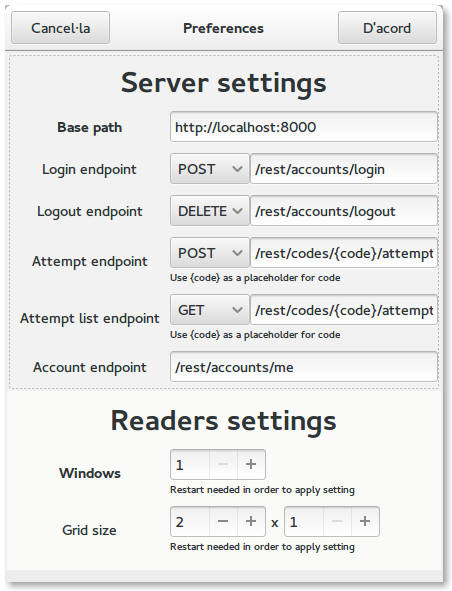
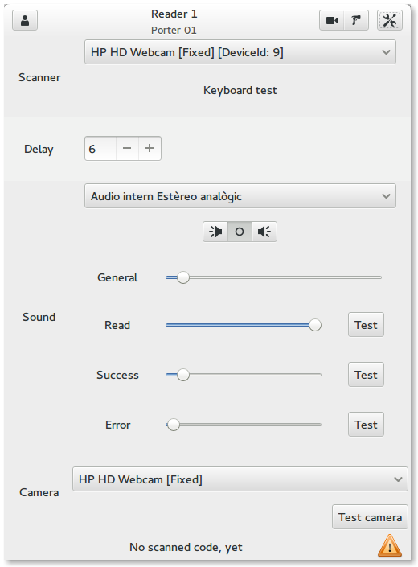
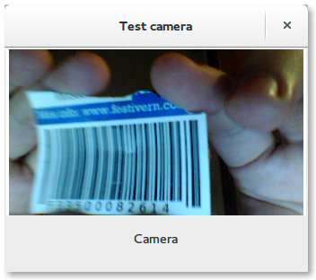
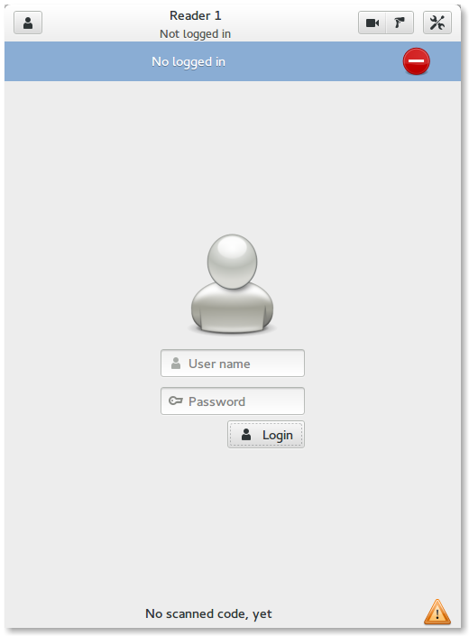
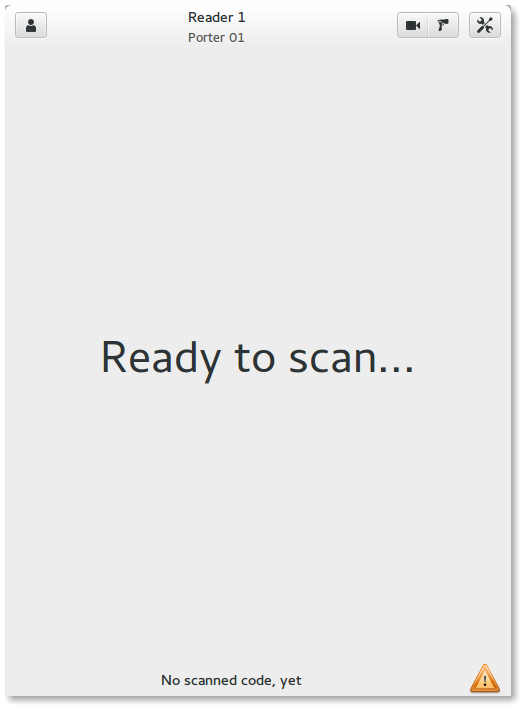
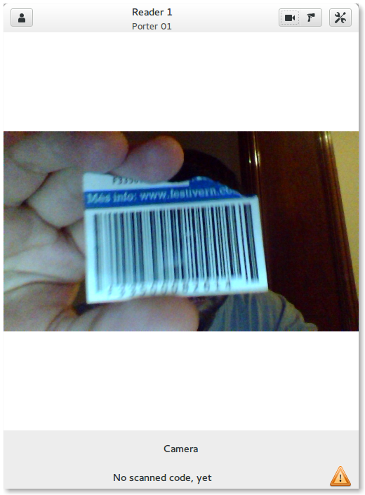
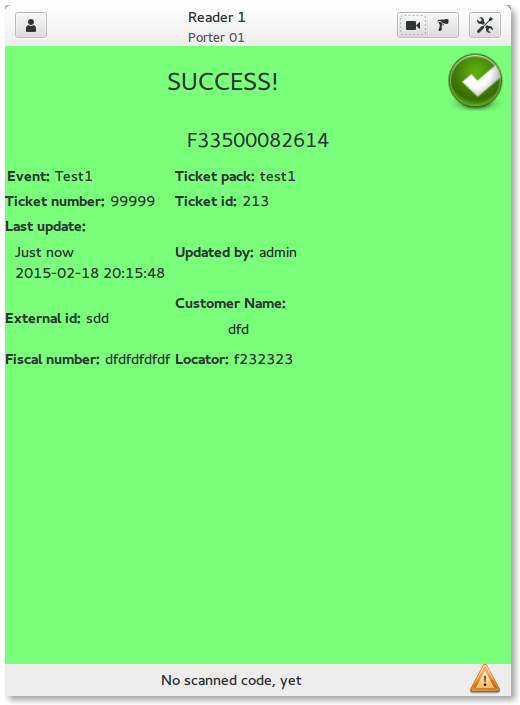
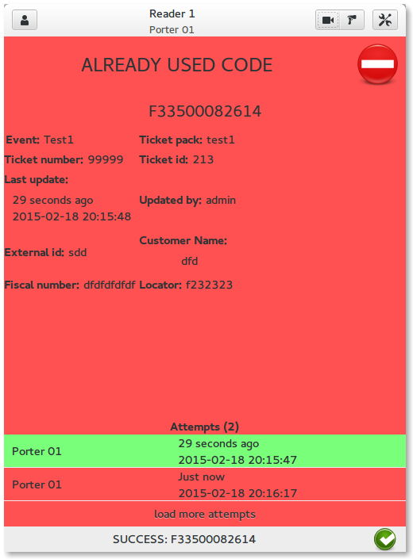
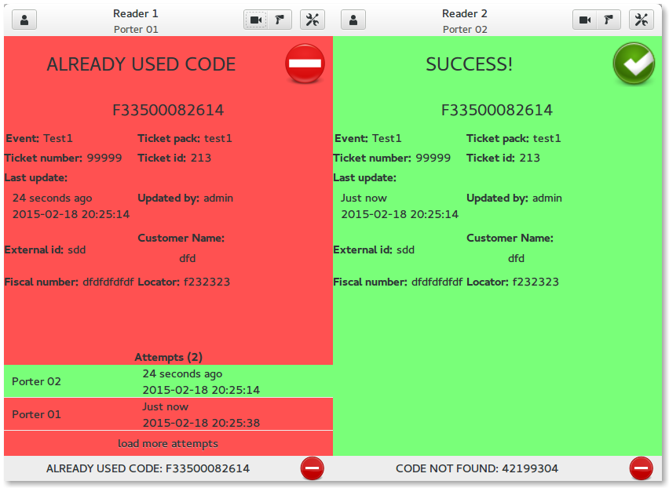

===========
Screenshots
===========

General settings
================

Reader settings
===============

Reader settings camera test
===========================

Reader login
============

Reader ready to scan
====================

Reader camera sensor
====================

Reader success result
=====================

Reader error result
===================

Application with multiple readers
=================================

